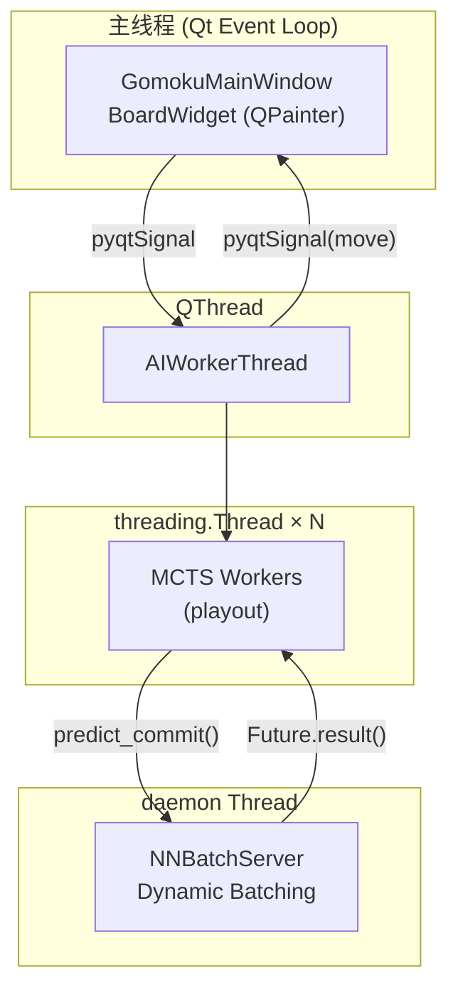

# Walkthrough: PyQt5 UI 重写 + 三层并发重构

## 完成的变更

### 1. [nn_batch_server.py](file:///f:/code/Gomoku_Competition_V1.0.3/Gomoku_Competition_V1.0.3/src/nn_batch_server.py) `[NEW]`

NN 推理批处理守护线程，仿照 Gamma Connect6 的 `nn_evaluate` 设计：

- 搜索线程通过 [predict_commit()](file:///f:/code/Gomoku_Competition_V1.0.3/Gomoku_Competition_V1.0.3/src/nn_batch_server.py#57-72) 提交推理请求，获得 `Future`
- 服务线程 Dynamic Batching：等待 1ms 或凑够 `max_batch_size`(8) 后批量推理
- 支持策略价值网络和 TSS 分类器两种推理
- `Future.set_result()` 唤醒对应搜索线程

---

### 2. [mcts_parallel.py](file:///f:/code/Gomoku_Competition_V1.0.3/Gomoku_Competition_V1.0.3/src/mcts/mcts_parallel.py) `[NEW]`

多线程树并行 MCTS 搜索：

| 特性 | 实现 |
|------|------|
| 共享搜索树 | [TreeNodeParallel](file:///f:/code/Gomoku_Competition_V1.0.3/Gomoku_Competition_V1.0.3/src/mcts/mcts_parallel.py#27-124) 每节点内置 `threading.Lock` |
| Virtual Loss | select 路径临时 +3 visits、降低 Q 值, backprop 后回退 |
| 多 Worker | `num_workers` 个线程并发 playout, `threading.Event` 控制停止 |
| NN 推理 | 通过 `NNBatchServer.predict_commit()` 异步提交 |

---

### 3. [players.py](file:///f:/code/Gomoku_Competition_V1.0.3/Gomoku_Competition_V1.0.3/src/players.py) `[MODIFIED]`

新增 [AIPlayerParallel](file:///f:/code/Gomoku_Competition_V1.0.3/Gomoku_Competition_V1.0.3/src/players.py#105-185) 类（未修改已有类）：

- 初始化时启动 [NNBatchServer](file:///f:/code/Gomoku_Competition_V1.0.3/Gomoku_Competition_V1.0.3/src/nn_batch_server.py#19-195) 守护线程
- 内部使用 [MCTSPlayerParallel](file:///f:/code/Gomoku_Competition_V1.0.3/Gomoku_Competition_V1.0.3/src/mcts/mcts_parallel.py#336-468)
- 对外接口与 [AIplayer](file:///f:/code/Gomoku_Competition_V1.0.3/Gomoku_Competition_V1.0.3/src/players.py#13-61) 完全一致
- 提供 [shutdown()](file:///f:/code/Gomoku_Competition_V1.0.3/Gomoku_Competition_V1.0.3/src/players.py#181-185) 方法关闭 NN 服务

---

### 4. [UI2_pyqt.py](file:///f:/code/Gomoku_Competition_V1.0.3/Gomoku_Competition_V1.0.3/UI2_pyqt.py) `[NEW]`

PyQt5 完整重写（替代原 tkinter 版 [UI2.py](file:///f:/code/Gomoku_Competition_V1.0.3/Gomoku_Competition_V1.0.3/UI2.py)）：

- **BoardWidget**: `QWidget` + `QPainter` 绘制棋盘、棋子、悬浮提示
- **AIWorkerThread** / **AIChooseWorkerThread**: `QThread` 子类, AI 计算在子线程执行, 通过 `pyqtSignal` 回传结果
- **QTimer**: 替代 `root.after` 实现实时计时
- **QMessageBox/QInputDialog**: 替代 tkinter 弹窗
- 保持全部竞技规则逻辑不变

## 架构图



## 验证结果

- ✅ 所有 4 个文件 Python 编译（`py_compile`）通过
- ⚠️ 运行测试需要 GPU 环境和 [gomoku_engine.pyd](file:///f:/code/Gomoku_Competition_V1.0.3/Gomoku_Competition_V1.0.3/gomoku_engine.pyd), 请手动执行 `python UI2_pyqt.py`

## 如何运行

```bash
cd f:\code\Gomoku_Competition_V1.0.3\Gomoku_Competition_V1.0.3
python UI2_pyqt.py
```

可在 [config.json](file:///f:/code/Gomoku_Competition_V1.0.3/Gomoku_Competition_V1.0.3/config.json) 中添加以下字段调整并发参数：

```json
{
    "numWorkers": 4,
    "maxBatchSize": 8
}
```
